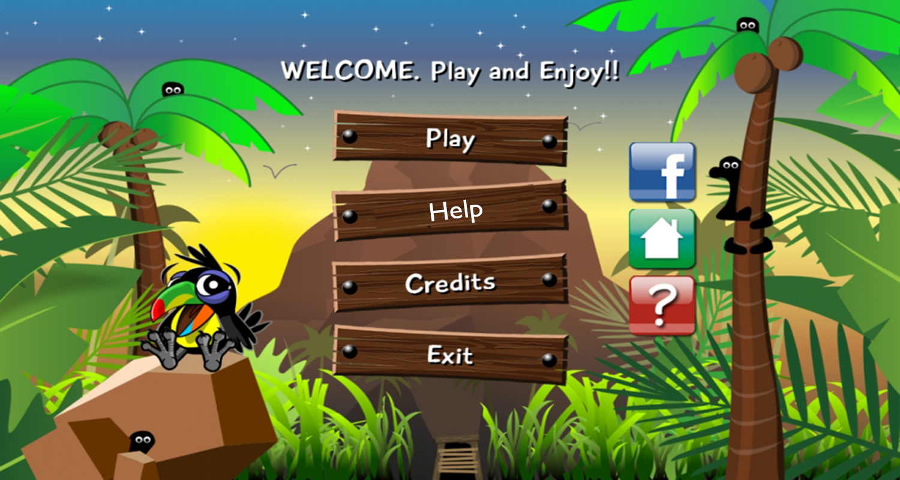
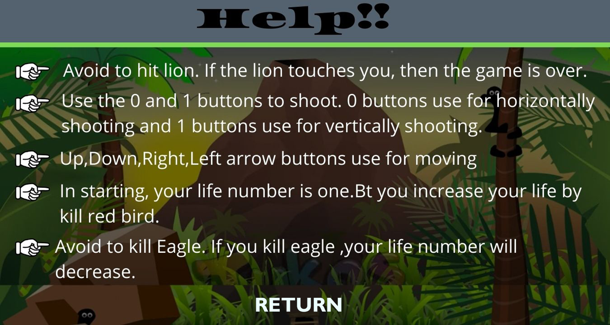
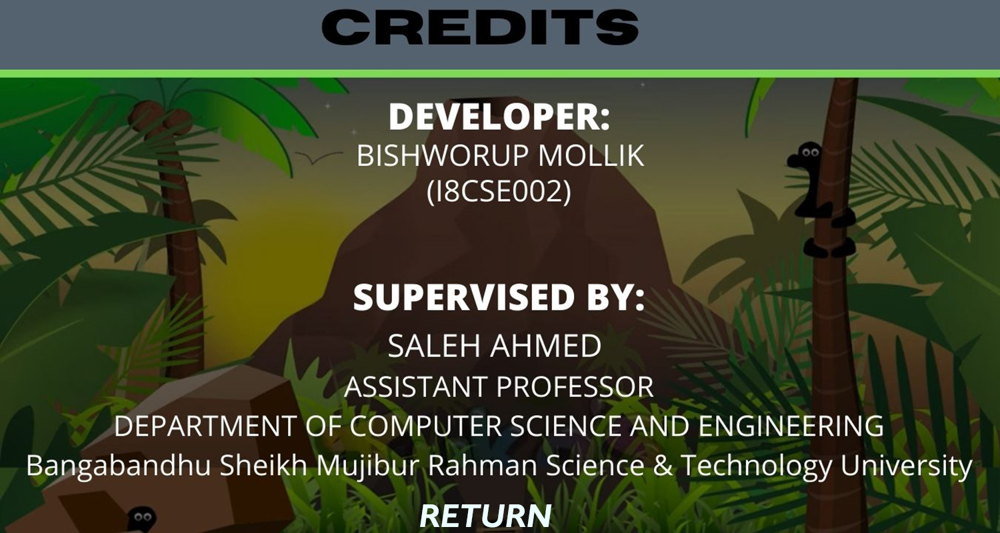

<h1 style="text-align: center;">Duck Hunting</h1>
This is a 2D game. There is a hunter who hunts ducks. Hunters face different obstacles like lions, eagles birds. This project was built using C++ language and IGraphics of Visual Studio 2013. It is fist year second semester project.

# Language and Tools

1. C++ Object Oriented Language

2. I-Graphics

3. Microsoft Visual Studio(2013)

# Characters
1. Duck  
  Hunter hunting duck which is increase point.
2. Red Bird 
   Red Bird like life gem. Hunter can increaseing Life number by hunting it. But can no more than three life.
3. Eagle 
   Decrease Life number if hunter hunting Eagle.
4. Lion  
   Lion Kill the hunter.It can not depend on life number. Hunter must kill lion. 
5. Hunter 
  It is main characters.
# Snapshots  

  

   
   

   
  
